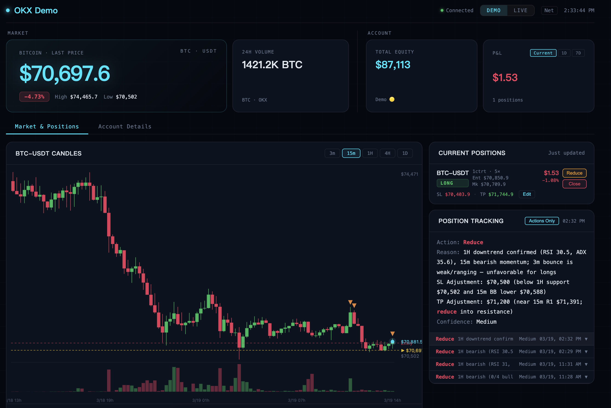

# Build Your Own Trade

[English](README.md) | [中文](README.zh-CN.md)

> **⚠️ For educational purposes only. Not financial advice. Use at your own risk.**

This project is now best thought of as an **AI-assisted OKX trading workspace**. Instead of one fixed dashboard, you can build a tabbed trading environment in the browser: edit the current tab in Build mode, use it in a cleaner Use mode, and let Claude recommend which modules or tab structures make sense.



## What It Does

The current app supports:

- **Modular trading panels** — ticker, chart, balance, positions, orders, analysis, history, trade review, and more
- **Tabbed workspaces** — split your flow into Watch / Trade / Review tabs
- **Build / Use workflow**
  - **Build mode**: edit the active tab
  - **Use mode**: use the workspace with fewer editing affordances
- **AI recommendations** — suggest what the current tab is missing and which tabs are worth creating
- **Trade execution** — place, amend, cancel, and close OKX orders
- **Technical analysis** — RSI, MACD, Bollinger Bands, support/resistance, and other signal summaries
- **Trade review** — history + AI-assisted postmortem flow

## Prerequisites

- OKX API credentials (demo mode recommended)
- Node.js >= 18
- Python 3
- OKX Trade CLI

## Local Start

```bash
npm install
npm install -g @okx_ai/okx-trade-cli
okx config init

node server.js
# Open http://localhost:3000
```

For development with auto-reload:

```bash
npm run dev
```

There is **no frontend build step**. The UI uses vanilla JS + ES modules.

## Docker Start

```bash
npm install -g @okx_ai/okx-trade-cli
okx config init

docker compose up
# Open http://localhost:3000
```

## Current Architecture

```text
Browser
  ├── public/core/app.js          # app shell, Build/Use mode, tabs, chat overlay
  ├── public/core/layout.js       # tabbed layout state + mounted components
  ├── public/core/builder.js      # builder side panel
  ├── public/core/chat.js         # AI chat UI
  ├── public/core/suggestions.js  # recommendations + suggested tabs
  └── plugins/okx/components/*    # self-contained UI panels

server.js
  └── core/engine.js              # plugin host, static serving, ws server
      └── plugins/okx/
          ├── actions/            # market / account / trading / analysis
          ├── store/              # DuckDB + JSON persistence
          ├── prompts/            # Claude prompts
          ├── adapter.js          # OKX CLI integration
          └── manifest.json       # capabilities + journey metadata
```

## Project Structure

```text
build-your-own-trading-tool/
├── core/                    # domain-agnostic runtime
├── plugins/okx/             # OKX plugin implementation
├── public/
│   ├── index.html           # minimal shell
│   └── core/                # client app framework: tabs, layout, builder, chat
├── tests/                   # unit, integration, and phased layout tests
├── docs/ARCHITECTURE_PLAN.md
└── server.js
```

## Data Storage

| Type | Engine | File |
|------|--------|------|
| K-line candles | DuckDB | `data/candles.duckdb` |
| Order history | JSON | `data/orders-{mode}.json` |
| Position tracking | JSON | `data/postrack-{mode}.json` |
| Analysis history | JSON | `data/analysis-{mode}.json` |

## Core Concepts

### Build vs Use
- **Use mode**: cleaner day-to-day usage
- **Build mode**: edit the current tab, add/remove panels, create suggested tabs

### Tabs
Each tab has its own module set and recently removed state. A typical structure is:
- **Watch** — ticker, chart, analysis
- **Trade** — positions, order panel, open orders
- **Review** — history, trade review, Claude insights

### AI Role
AI is best used here as a **planner / recommender**:
- recommend which modules fit the current tab
- recommend when to create a Watch / Trade / Review tab
- explain where a component fits best

The user still controls the final organization and layout.

## Testing

```bash
npm test
```

Focused checks that are useful during architecture/UI work:

```bash
node tests/phase5.test.js
node tests/phase6-layout.test.js
```

## Notes

- Demo mode is the safest default for experimentation
- The active exchange integration path is **OKX CLI**
- If `okx` works in your terminal but not from Node, the usual cause is PATH / CLI installation mismatch

## GitHub

Remote repository:

```text
https://github.com/fanqi1909/build-your-own-trading-tool
```
