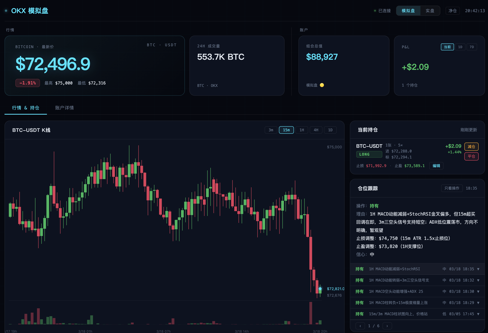

# 构建你自己的交易系统

[English](README.md) | 中文

> **⚠️ 仅供学习参考，不构成任何投资建议。使用风险自负。**

基于 OKX 构建你自己的交易系统 — 下单执行、持仓追踪、技术分析、AI 信号、交易复盘，全部在浏览器中完成。



## 功能概览

连接你的 OKX 账户，提供以下功能：

- **实时行情** — BTC-USDT 每 5 秒更新
- **K 线图表** — Canvas 渲染的蜡烛图，支持操作标记
- **持仓追踪** — 实时盈亏、杠杆、强平价格
- **技术分析** — 通过 Python 脚本计算 RSI、MACD、布林带等指标
- **AI 建议** — Claude 驱动的行情评估和仓位建议
- **订单管理** — 在看板中下单、撤单、改单

## 前置条件

- OKX API 凭证（在 [OKX](https://www.okx.com) 创建，推荐使用模拟盘）
- Docker & Docker Compose **或** Node.js >= 18 + Python 3

## 快速开始（Docker）

```bash
# 1. 安装 OKX Trade CLI 并配置凭证（一次性操作）
npm install -g @okx_ai/okx-trade-cli
okx config init    # 交互式向导，创建 ~/.okx/config.toml

# 2. 启动
docker compose up

# 打开 http://localhost:3000
```

`~/.okx/config.toml` 以只读方式挂载到容器中，无需重复配置凭证。本地编辑源文件会通过 volume mount 自动同步，Node.js `--watch` 模式会自动重载。

## 本地开发（不使用 Docker）

```bash
# 前置条件：Node.js 20（推荐）、Python 3、OKX Trade CLI
# 注意：Node 25+ 可能无法编译 duckdb 原生模块，建议使用 Docker 或 Node 20
npm install -g @okx_ai/okx-trade-cli
okx config init

npm install
npm run dev        # --watch 模式，修改自动重载
# 打开 http://localhost:3000
```

默认以**模拟盘模式**启动，可安全实验。

## 架构

```
浏览器 (index.html)
    │  WebSocket
    ▼
server.js  ──── adapters/okx-cli.js ──── okx CLI ──── OKX API
    │
    ├── lib/store.js   (DuckDB + JSON 持久化)
    ├── lib/ai.js      (Claude CLI 集成)
    └── analyze.py     (技术指标计算)
```

### 刷新频率

| 数据 | 间隔 | 来源 |
|------|------|------|
| 行情 | 5 秒 | `market ticker` |
| 余额 & 持仓 | 60 秒 | `account balance` + `swap positions` |
| 挂单 | 10 秒 | `swap orders` |
| K 线 + 分析 | 10 分钟 | `market candles` → `analyze.py` → Claude |
| 持仓追踪 | 3 分钟 | Claude 评估 |

### 数据存储

| 类型 | 引擎 | 文件 |
|------|------|------|
| K 线 | DuckDB | `data/candles.duckdb` |
| 订单历史 | JSON | `data/orders-{mode}.json` |
| 持仓追踪 | JSON | `data/postrack-{mode}.json` |
| 分析历史 | JSON | `data/analysis-{mode}.json` |

## 目录结构

```
trade-dashboard/
├── server.js               # 入口 — Express + WebSocket + 定时器
├── analyze.py              # 技术分析（读取 K 线，输出指标）
├── adapters/
│   ├── base.js             # AdapterError + 类型定义（JSDoc）
│   ├── okx-cli.js          # CLI 适配器（默认）— 调用 okx 命令
│   └── okx-rest.js         # REST 适配器（占位，待实现）
├── lib/
│   ├── store.js            # 数据层 — 订单、持仓、K 线（DuckDB）
│   └── ai.js               # AI 层 — Claude 调用 + prompt 构造
├── public/
│   └── index.html          # 单文件前端（~2000 行，原生 JS + Canvas）
└── tests/
    ├── adapters.test.js
    ├── store.test.js
    ├── ai.test.js
    └── server.test.js      # 集成测试（需要运行中的服务器）
```

## 环境变量

| 变量 | 默认值 | 说明 |
|------|--------|------|
| `EXCHANGE_ADAPTER` | `okx-cli` | 使用的适配器（`okx-cli` 或 `okx-rest`） |
| `ANALYZE_PY` | `./analyze.py` | 技术分析脚本路径 |
| `PORT` | `3000` | 服务端口（需修改 `server.js`） |

## 测试

```bash
# 单元测试（无外部依赖）
npm test

# 集成测试（需要 okx CLI + 3000 端口可用）
npm run test:integration
```

## 模拟盘 / 实盘切换

在看板 UI 中切换模拟盘和实盘模式。数据按模式分离存储，互不干扰。

## 如何扩展

### 添加新的交易所适配器

创建 `adapters/my-exchange.js`，导出与 `okx-cli.js` 相同的接口（`fetchTicker`、`fetchBalance`、`fetchPositions` 等），然后：

```bash
EXCHANGE_ADAPTER=my-exchange docker compose up
```

参考 `adapters/base.js` 了解完整接口定义，`adapters/okx-rest.js` 提供了脚手架。

### 添加技术指标

编辑 `analyze.py` — 从 stdin 读取 K 线数据，向 stdout 输出指标文本。可以添加任何你需要的指标（如 OBV、一目均衡表）。输出会直接传给 AI 层并显示在看板中。

### 自定义 AI Prompt

编辑 `lib/ai.js` — `buildClaudePrompt()` 控制 AI 看到的行情评估内容，`buildPositionTrackPrompt()` 控制仓位建议。调整 prompt 以匹配你的交易风格。

### 自定义前端

编辑 `public/index.html` — 单文件原生 JS，无需构建工具。直接添加新的 Tab、图表或组件，通过 volume mount 自动生效。

## 了解更多

- [架构详解](docs/ARCHITECT.md) — 完整数据流、设计决策和模块职责
- [OKX Trade CLI 文档](https://github.com/okx/agent-tradekit/blob/master/docs/cli-reference.md) — 所有可用的 CLI 命令
